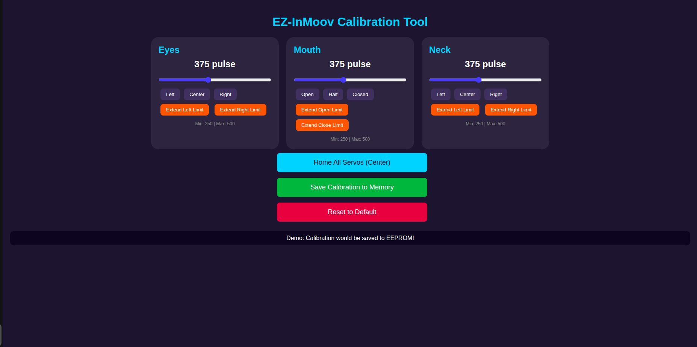

# EZ-InMoov ESP32 Calibration Tool

> **The Problem:** The original EZ-InMoov controller locks you into a proprietary ecosystem with severe restrictions. It does not support standard communication protocols like ROS2, MQTT, HTTP, or WebSocket without monthly subscriptions, and you cannot write custom firmware or integrate the robot head with external systems.
>
> **The Solution:** This ESP32-based replacement completely eliminates these limitations. The ESP32 supports ROS2 (via micro-ROS), MQTT, HTTP/WebSocket, Serial, and any protocol compatible with the platform - all completely free with no subscriptions. You can now integrate your EZ-InMoov head with ROS2 robots, home automation systems, custom dashboards, or any other application. The entire project is open source under the MIT license, giving you full freedom to modify, extend, and control your robot head without restrictions or recurring fees.
## Web Interface

<p align="center">
  
</p>

## What it does

- Control servos from browser
- Adjust min/max limits
- Save calibration (stored in EEPROM)
- Works on phone/laptop
- Real-time response

---

## Hardware

- ESP32  
- PCA9685  
- 3 servo motors (SG90 works fine)  
- External 5V supply (don’t skip this)  
- Jumper wires  

---

## Wiring

### ESP32 → PCA9685

- 3.3V → VCC  
- GND → GND  
- GPIO22 → SCL  
- GPIO21 → SDA  

### Power

- 5V supply → V+ (PCA9685)  
- GND → GND (PCA9685)  

**Important:**  
Connect ESP32 GND with power supply GND (common ground).  
If you miss this, things will behave weird.

---

### Servos

- Channel 0 → Eyes  
- Channel 1 → Mouth  
- Channel 2 → Neck

  <a href="docs/screenshots/demo.gif">
  
</a>


Each servo:
- Red → V+  
- Brown/Black → GND  
- Yellow/Orange → Signal  

---

## Setup

Install ESP32 board in Arduino IDE:

Add this in Preferences:

https://raw.githubusercontent.com/espressif/arduino-esp32/gh-pages/package_esp32_index.json


Then install ESP32 from Boards Manager.

Install library:
- Adafruit PWM Servo Driver

---

## WiFi

Before uploading, update this:

```cpp
const char* ssid = "YOUR_WIFI";
const char* password = "YOUR_PASSWORD";
Upload
Select: ESP32 Dev Module
Select correct port
Upload
Usage
Open Serial Monitor (115200)
You’ll see an IP address
Open it in browser
Move sliders → servos move
Click save when done
Calibration
Move servo
Extend limit
Confirm
Save

That’s it.

Issues

Servo shaking
→ Power supply is weak

No movement
→ Check SDA/SCL

Page not opening
→ Same WiFi?

Random movement
→ Missing common ground

Notes
Don’t power servos from ESP32
Use proper 5V supply
You can extend this for more servos easily

